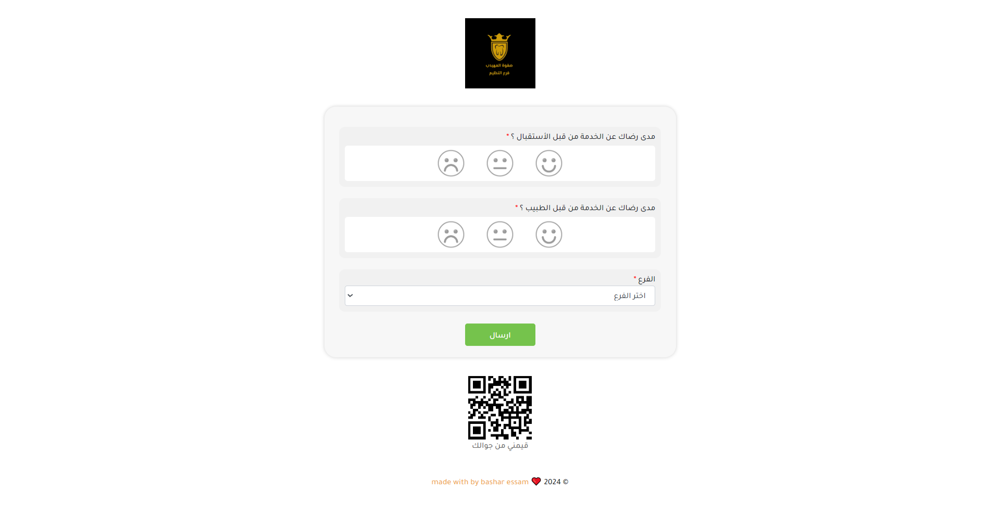
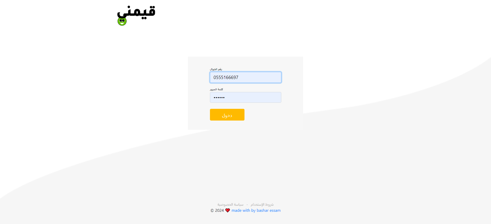
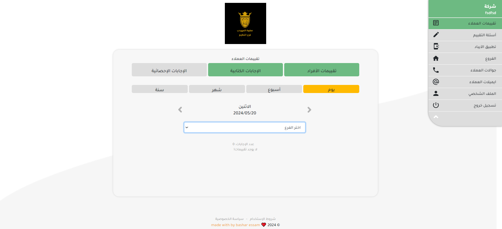
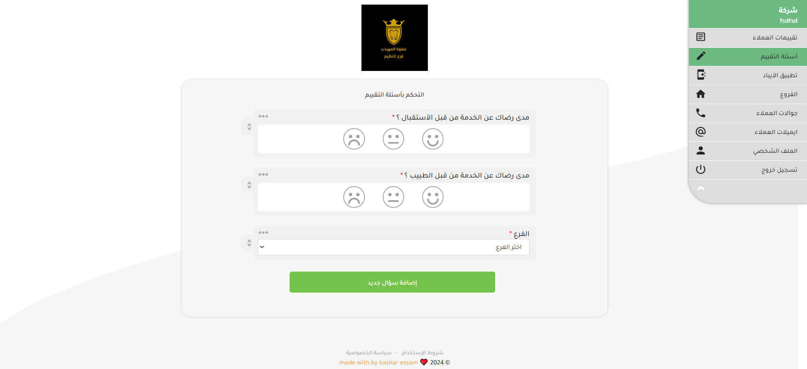
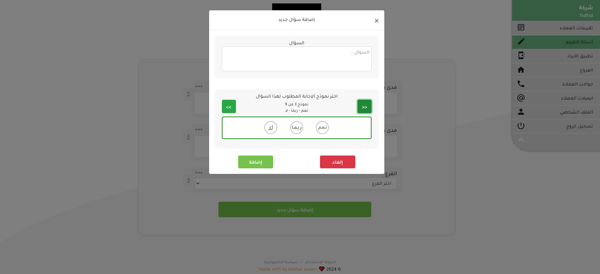
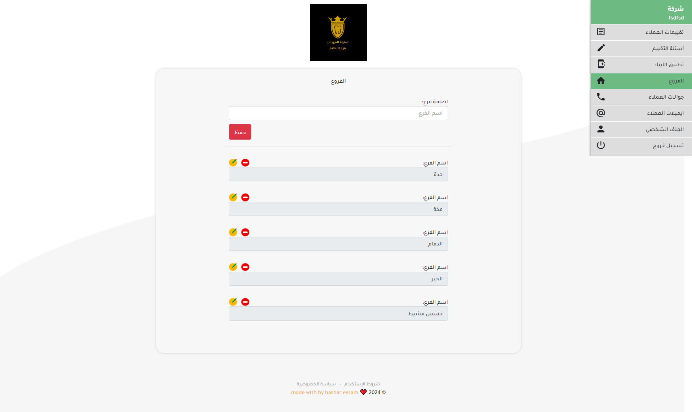
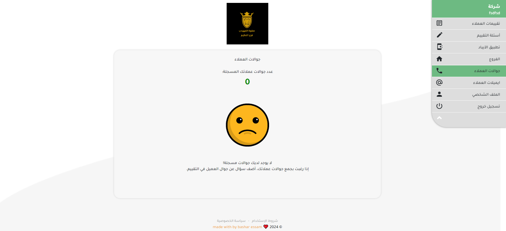
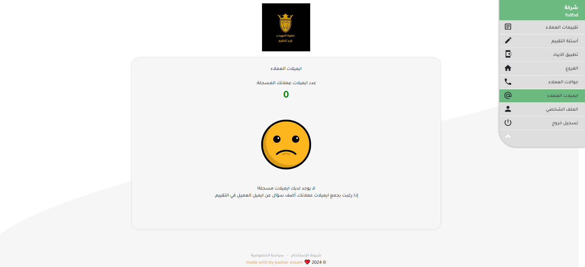
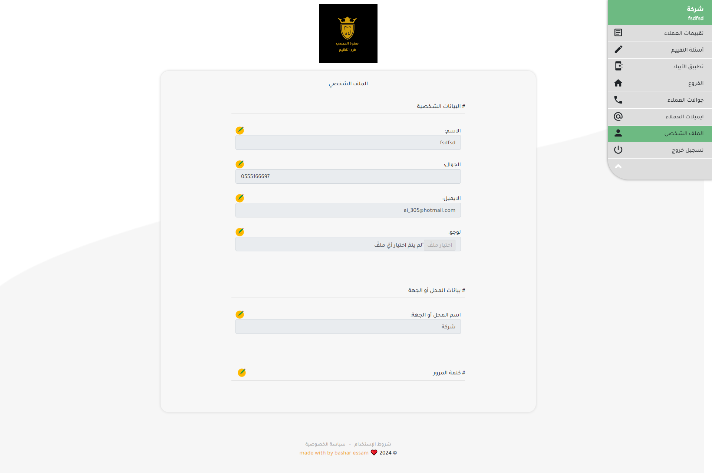

# ⭐ نظام تقييمات العملاء

مشروع ويب لإدارة وتقييم أداء العملاء، يتضمن **تقييمات – أسئلة – فروع – بيانات التواصل – إدارة بروفايل**، مع واجهة سهلة الاستخدام.

---

## 📄 الصفحات الرئيسية في النظام

- **📊 تقييمات العملاء**  
  عرض جميع التقييمات التي يقوم العملاء بإدخالها.

- **❓ أسئلة التقييم**  
  إدارة وإنشاء الأسئلة التي يجيب عنها العملاء أثناء عملية التقييم.

- **📱 تطبيق الآيباد**  
  دعم تطبيق آيباد لعرض التقييمات أو إدخالها بشكل مباشر.

- **🏢 الفروع**  
  إدارة فروع الشركة أو المؤسسة المرتبطة بالتقييمات.

- **📞 جوالات العملاء**  
  حفظ وإدارة أرقام هواتف العملاء.

- **📧 إيميلات العملاء**  
  حفظ وإدارة البريد الإلكتروني الخاص بالعملاء.

- **👤 الملف الشخصي**  
  صفحة الحساب الشخصي للمستخدم مع إمكانية تعديل البيانات.

- **🔒 تسجيل خروج**  
  لتسجيل الخروج من النظام بشكل آمن.

---

## 💡 المميزات الأساسية
- إدارة شاملة لتقييمات العملاء.  
- إمكانية إضافة وتخصيص أسئلة التقييم.  
- ربط النظام مع تطبيق آيباد للتسهيل على الموظفين.  
- حفظ بيانات التواصل (هواتف – إيميلات).  
- واجهة تحكم للفروع لإدارة العملاء في كل فرع.  
- دعم الحساب الشخصي مع إمكانية تسجيل الدخول والخروج.  

---

## 🖼️ صور من النظام (Screenshots)

  

  

  

  

  

  

  

  
  
  

---

## 📌 ملاحظات تقنية
- الواجهة مبنية بـ **HTML, CSS, Material Icons**.  
- يمكن تطوير النظام لاحقًا لإضافة **لوحة تحكم متقدمة** و **تقارير إحصائية**.  
- يدعم التكامل مع الأجهزة اللوحية (Tablet / iPad).  

---
